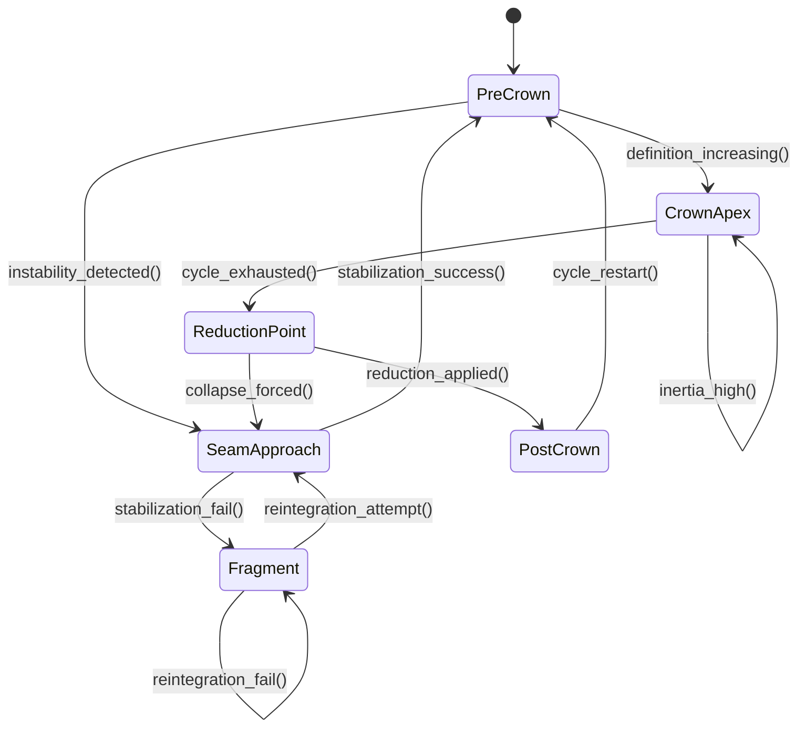

Invariant Anchor:

This module expresses how [[module]] behaves when cohesion is under pressure.

[[Invariant-00 - Cohesion Under Pressure]]

# Crown Structure

*"The moment of maximum definition before mandatory reduction."*

## Invariant Anchor

**The Crown expresses the system's maximum-definition invariant:**

> **A cycle cannot exceed its own structure; at the apex, it must turn.**

The Crown is not symbolic. It is a **boundary condition** - the point where the system reaches full specification and can no longer continue without collapse, inversion, or reduction.

## Definition

The **Crown** is the structural apex of any Fib Flower cycle. It is the point where:

- all properties are fully expressed
- drift velocity approaches zero
- tension reaches its maximum allowable value
- resonance peaks
- collapse becomes inevitable

The Crown is not a place - it is a **state**.

## Core Properties

### 1. Total Specification

At the Crown, the node or system expresses **100% of its definitional content**. Nothing is latent. Nothing is unresolved. Nothing is hidden.

This is the moment of **maximum clarity**.

### 2. Irreversibility

Once the Crown is reached, the system cannot remain there. It must:

- collapse
- invert
- shed mass
- reduce
- or transition into a new cycle

The Crown forbids stasis.

### 3. Imminent Collapse

The Crown is the **trigger condition** for collapse. Collapse does not begin randomly - it begins **at the Crown**.

This is where:

- brittleness peaks
- cohesion thins
- drift vectors destabilize
- anchor tension exceeds tolerance

The Crown is the **last stable moment**.

## Crown Structure in the Fib Flower

### 5-Ring -> 8-Ring -> 13-Ring -> 21-Ring -> 34-Ring

Each ring has its own Crown:

- **5-Ring Crown** - initiation fully expressed
- **8-Ring Crown** - variation exhausted
- **13-Ring Crown** - pattern complete
- **21-Ring Crown** - stability maximized
- **34-Ring Crown** - synthesis total

At each Crown, the system must **turn**.

## Crown -> Collapse Pathway

1. Crown reached
2. Tension exceeds elasticity
3. Brittleness spikes
4. Shear lines form
5. Collapse initiates
6. Fragmentation ecology activates
7. Reformation basin forms

The Crown is the **hinge** between:

- full definition
- and collapse ecology

## Crown Structure in the Garden

In the Garden (global phase-space):

- Crowns appear as **bright, high-density nodes**
- They act as **temporary attractors**
- They generate **pressure waves**
- They seed **collapse zones**
- They define **orbit changes**

A Crown is a **moment of maximum gravitational identity**.

## Links

Add these if they exist in your vault:

- [[Invariant-00 - Cohesion Under Pressure]]
- [[Collapse Zones]]
- [[08 - Player/Collapse Ecology Mapping]]
- [[Brittleness Fields]]
- [[Drift Mechanics]]
- [[Cohesion Dynamics]]
- [[Fib Flower]]
- [[Reformation Basins]]
- [[Anchor Tension]]

# Crown Structure - Mermaid Diagram

## What this diagram expresses (aligned with canonical Crown.md)

### PreCrown

The system is accumulating definition, clarity, and structural tension.

### CrownApex

The moment of **maximum definition** - the Crown itself. High inertia, slow cycle, player-driven stability.

### ReductionPoint

The structural boundary condition: the **last instant before mandatory reduction**.

### PostCrown

The system has shed definition and begins the next cycle.

### SeamApproach

Instability, ambiguity, or collapse forces the system toward the Seam - the opposite pole of the Crown.

### Fragment

Failure to stabilize leads to fragmentation until reintegration succeeds.
