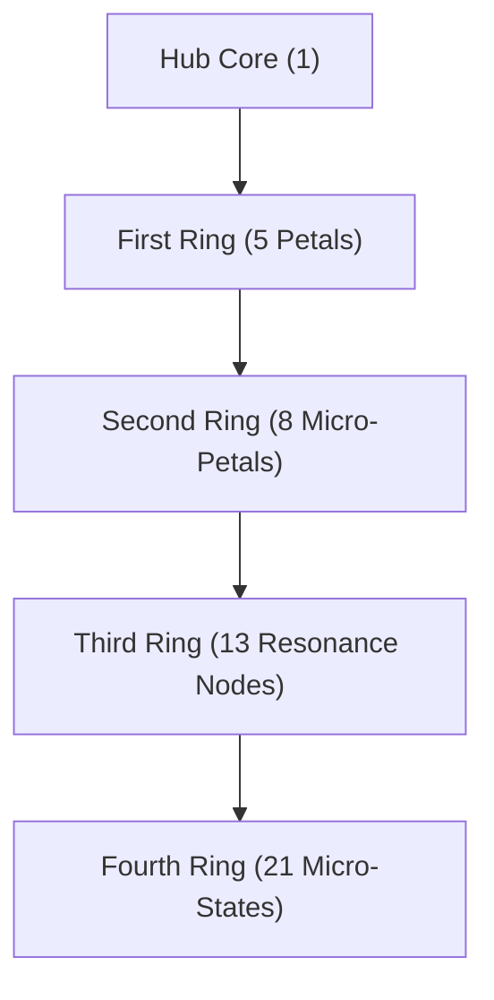

# Fib Flower - Core Structural Organism

The **Fib Flower** is the fundamental structural unit of **Threshold**. It is simultaneously:

- an **organism**
- a **system architecture**
- a **gameplay loop engine**
- a **world-state container**
- a **node in the universal cluster graph**

Every Flower contains **five recursive layers**, each following Fibonacci expansion:

1 -> 5 -> 8 -> 13 -> 21

These layers define the Flower's **behavior**, **pressure**, **drift**, **resonance**, and **interaction** with other Flowers.

## Layer Structure

### 1. Hub Core (1)

The center of the Flower. Contains:

- **Identity**
- **Ethos**
- **Anchor**
- **Primary Resonance Signature (RS)**

Links: [[Echo Protocol]] | [[Crown Structure]] | [[Seam Structure]]

### 2. First Ring (5 Petals)

Five major **world-states** or **biomes**.

Each petal is a **realm** with:

- a biome
- a resource loop
- a pressure profile
- a drift vector
- a Crown/Seam polarity

Links: [[Pinwheel Realms]] | [[Pressure System]] | [[Drift System]]

### 3. Second Ring (8 Micro-Petals)

Fine-grained **micro-states** that modulate the petals.

These handle:

- local events
- micro-pressures
- micro-drifts
- environmental cues
- player-triggered shifts

Links: [[Microstates]] | [[Environmental Cues]]

### 4. Third Ring (13 Resonance Nodes)

These nodes manage:

- EchoNode behavior
- signal processing
- cluster resonance
- local coherence
- drift propagation

Links: [[EchoNode State Machine]] | [[Echo System State Machine]]

### 5. Fourth Ring (21 Micro-States)

The Flower's **dynamic surface**.

Handles:

- emergent behavior
- instability
- collapse
- reintegration
- Crown/Seam transitions

Links: [[Harmony Emergence]] | [[Fragmentation]] | [[Reduction Cycle]]

## Cluster Geometry

Every Fib Flower exists inside a **six-Flower cluster**:

- **1 Hub Flower**
- **5 Orbiting Flowers**

This geometry is universal across Threshold.

Links: [[Cluster Geometry]] | [[Orbit Mechanics]] | [[Cross-Flower Migration]]

## Mermaid Diagram - Fib Flower Structure

This diagram gives a clean visual hierarchy of the Flower's recursive structure.

## Cross-Node Links (Recommended)

Add these backlinks inside this note:

- [[Echo Protocol]]
- [[EchoNode State Machine]]
- [[Echo System State Machine]]
- [[Crown Structure]]
- [[Seam Structure]]
- [[Pressure System]]
- [[Drift System]]
- [[Cluster Geometry]]
- [[Pinwheel Realms]]
- [[Harmony Emergence]]

This turns **Fib Flower.md** into the central architecture hub in the vault.
